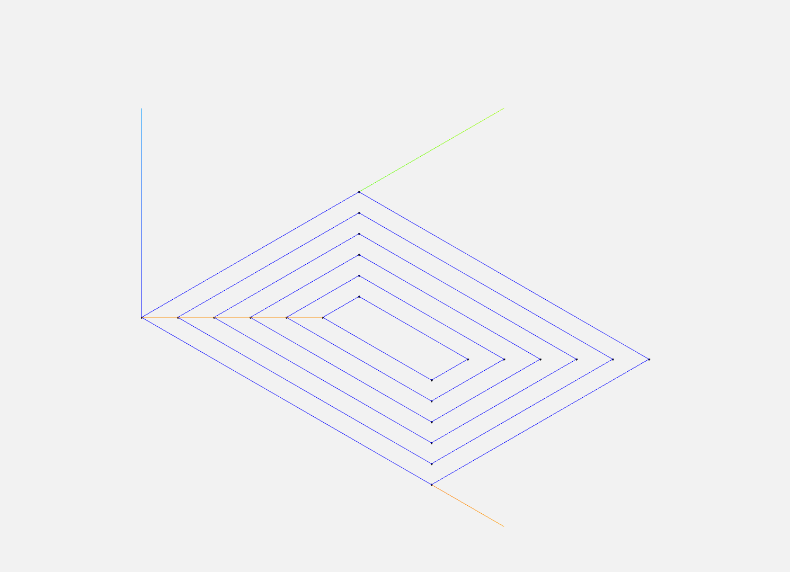
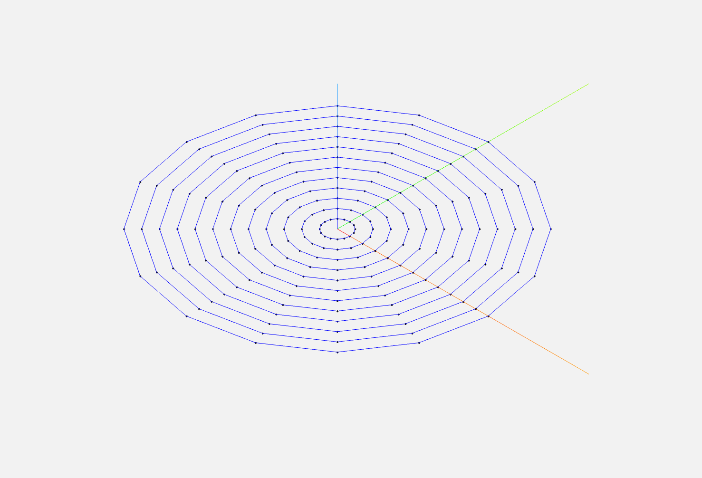
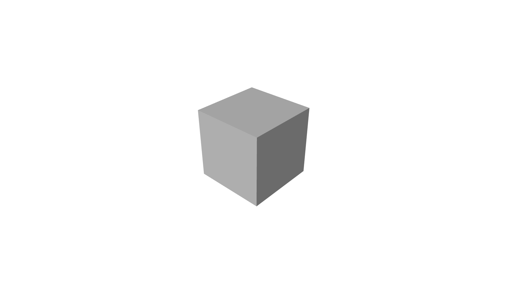
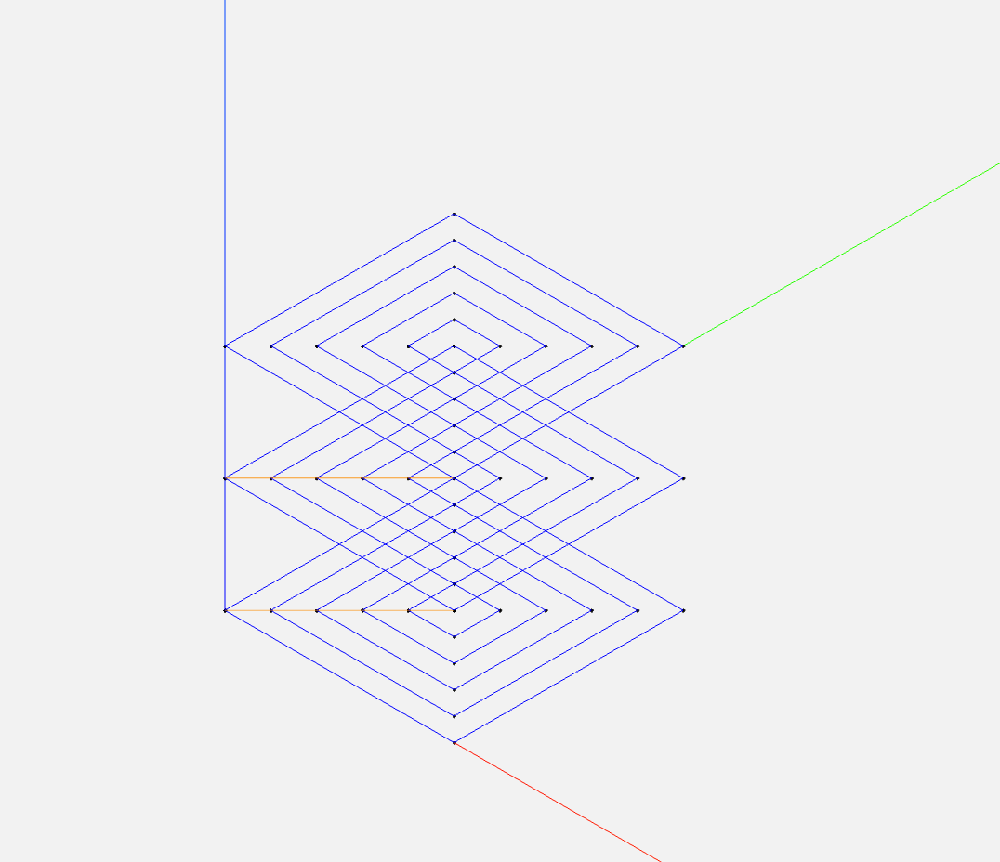

# simple-slice

A simple slicing library for 3D geometries with computational geometry primitives and 2D/3D toolpath generation.

This repository contains:
- **Geometry Library**: 3D point, vector, and projection utilities
- **Slicer Library**: 2D and 3D mesh slicing with G-code toolpath generation
- **Demos**: Air hockey game simulation and slicer demonstrations
- **Tests**: Comprehensive unit tests for geometry and slicer components

## Project Structure

### `src/geometry/`
Header-only library providing computational geometry primitives:
- **`point.hpp`**: 3D point class with Cartesian coordinates
- **`vector.hpp`**: 3D vector operations (dot product, cross product, magnitude, distance)
- **`projections.hpp`**: Point projections, line segment intersections, bounding boxes
- **`utilities.hpp`**: Utility functions (sign, clamp, epsilon constants)

### `src/slicer/`
Slicing library for generating 3D printing toolpaths:
- **`shapes.hpp`**: 2D/3D shape definitions (Rectangle, Circle, Triangle, Layer, Box)
- **`perimeters.hpp`**: Perimeter generation for rectangles, circles, and layers
- **`mesh_slicer.hpp`**: Triangle mesh slicing into horizontal layers
- **`stl_reader.hpp`**: ASCII STL file parsing
- **`toolpath.hpp`**: G-code formatting for toolpaths

### `src/apps/`
Demo executables and example outputs:
- **`slicer2d_main.cpp`**: 2D slicer demo (rectangles and circles)
- **`slicer_main.cpp`**: 3D mesh slicer demo (STL files)
- **`images/`**: Example output visualizations
- **`cube_sample.stl`**: Sample STL file for testing

### `src/air_hockey_game/`
Physics simulation demo:
- **`air_hockey_game.hpp/cpp`**: Air hockey table simulation
- **`air_hockey_game_main.cpp`**: Demo executable
- Simulates puck trajectory with wall collisions

### `tests/`
Unit tests organized by component:
- **`geometry/`**: Tests for geometry primitives
- **`slicer/`**: Tests for slicing functionality
- **`air_hockey_game/`**: Tests for air hockey simulation

## Current Capabilities

### Geometry Library
- 3D point and vector operations
- Dot product, cross product, magnitude, distance calculations
- Point projections onto lines and line segments
- Line segment intersection detection (2D)
- Axis-aligned bounding boxes (3D)
- Signed area calculations (2D)

### Slicer Library
- **2D Slicing**: Generate perimeter toolpaths for rectangles and circles
- **3D Mesh Slicing**: Slice triangle meshes (ASCII STL) into horizontal layers
- **Contour Extraction**: Extract outer contours from mesh-plane intersections
- **Perimeter Generation**: Generate inward-offset rectangular perimeters
- **G-code Export**: Export toolpaths in G-code format (G0/G1 commands)

### Demos
- **Air Hockey Game**: Physics simulation with wall collision detection
- **2D Slicer Demo**: Visualize rectangle and circle toolpaths
- **3D Slicer Demo**: Slice STL meshes and generate layered toolpaths

## Example Outputs

### 2D Slicer Toolpaths

#### Rectangle Toolpath


#### Circle Toolpath


### 3D Slicer Toolpaths

#### Cube Mesh


#### Cube Toolpath


## Build

This project uses CMake and builds:
- `air_hockey_game` - Air hockey simulation demo
- `slicer2d_main` - 2D slicer demo (rectangles and circles)
- `slicer_main` - 3D mesh slicer demo (STL files)
- `unit_tests` - Comprehensive unit test suite

## Instructions

```bash
# From the repository root, build the project with:
cmake -S . -B build
cmake --build build
```

## Run

```bash
# Air hockey game demo:
./build/air_hockey_game

# 2D slicer demo (generates slicer2d_rectangle.gcode and slicer2d_circle.gcode):
./build/slicer2d_main

# 3D slicer demo (generates slicer_mesh.gcode):
./build/slicer_main [stl_file]
```

For more details on the slicer demos, see [src/apps/README.md](src/apps/README.md).

## Test

```bash
# From the repository root, run the unit tests:
ctest --test-dir build --output-on-failure
```

The test suite includes:
- Geometry library tests (point, vector, projections, utilities)
- Slicer library tests (shapes, perimeters, toolpath, STL reader, mesh slicer)
- Air hockey game tests

## Future Roadmap

- Enhanced computational geometry algorithms
- Support for binary STL files
- Exact contour-following perimeters (not just bounding boxes)
- NURBS based slicing for CAD models
